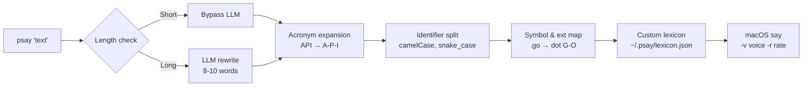

# psay

Phonetic text processing for the macOS `say` command. Makes developer jargon readable by voice.

`psay "Found deadlock in auth_service.go due to A-B-A problem in the mutex pool."`

→ macOS `say` hears: *"Found deadlock in auth service dot G-O due to A-B-A problem in the mutex pool."*

## Problem

macOS `say` is a solid TTS engine, but it reads developer text literally:

- `API` → "ah-pee-ee" (wrong)
- `getUserById` → "get user by id" (misses the acronym)
- `auth_service.go` → mangled
- Long explanations get spoken in full, burning time on noise

## What psay does

psay sits between an AI agent and `say`, running a **phonetic pipeline** that transforms text before it reaches the TTS engine:



## Agent Protocol

See `AGENTS.md` for the prompt template and rules on how AI agents should call `psay` at key moments. The example below shows the format:

```bash
psay '[Action/Discovery] on [Target] because [Context]. [My Take / Advice]'
```

## Backlog

- [ ] CLI receiver — parses `psay "text"` input
- [ ] Regex-based phonetic processor — acronyms (`API` → `A-P-I`), camelCase and snake_case splitting (`getUserById` → `get user by I-D`), symbol and file extension mapping (`.go` → `dot G-O`, `!=` → `not equal`)
- [ ] macOS `say` executor — calls `say` with configurable voice (`-v`) and rate (`-r`)
- [ ] LLM bypass — skip LLM for short, well-structured messages (zero latency)
- [ ] LLM rewrite — condense long messages to 8–10 words: `[Core Problem] + [Action/Advice]`
- [ ] LLM fallback — route to phonetic-only processing if LLM is unavailable
- [ ] Custom lexicon — `~/.psay/lexicon.json` for user-defined pronunciation overrides (e.g., `"kubectl": "kube-control"`), edited manually