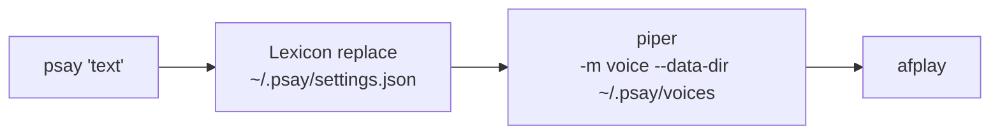

# psay

Speakable announcements for AI agents. psay turns developer jargon into short, speakable text and plays it through local TTS.

`psay "Found deadlock in auth_service.go due to A-B-A problem in the mutex pool."`

→ Piper speaks: *"Found deadlock in auth service dot G-O due to A-B-A problem in the mutex pool."*

Zero Go dependencies — stdlib only, plus the piper CLI and `afplay`.

## Install

```bash
curl -fsSL https://raw.githubusercontent.com/ssupawat/psay/main/install.sh | sh
```

Installs the `psay` binary to `~/.local/bin`, piper via uv/pipx, and the default voice. Requires macOS. Or with Go: `go install github.com/ssupawat/psay@latest`. First announce: `psay 'Hello from psay.'` — config auto-initializes.

Uninstall with the matching script (keeps your lexicon unless `--purge`):

```bash
curl -fsSL https://raw.githubusercontent.com/ssupawat/psay/main/uninstall.sh | sh
```

## Problem

Agent announces are spoken for human ears. The listening test showed piper's espeak front-end already reads most developer text correctly — camelCase (`getUserById` → "get user by I-D"), symbols (`x != y` → "ex not-equals why"), extensions (`auth_service.go` → "auth service dot go"), versions (`v1.2.3` → "vee one point two point three").

What it gets wrong is a narrow class of word-level misreads:

- Lowercase acronyms read as words: `aws` → "awz"
- Dev shorthand: `db` → "dee bee"
- psay's own name: `psay` → "say"

All are word substitutions — exactly what a lexicon fixes. No phonetic engine needed. Brevity is not psay's problem either — the calling agent condenses its own announce before invoking psay (see [PSAY.md](./PSAY.md)).

## What psay does

psay sits between an AI agent and the TTS engine, running a text pipeline that transforms jargon before synthesis:



The listening test killed the planned identifier splitter and symbol mapper — espeak already does that work. What remains is the lexicon and the plumbing.

## Agent protocol

[PSAY.md](./PSAY.md) is the announcement protocol for AI agents. Run `psay init` inside a project to write it there, then attach it: `@PSAY.md` import in `CLAUDE.md`, or paste into `AGENTS.md`. The whole protocol in one line:

```bash
psay '[Action/Discovery] on [Target] because [Context]. [My Take / Advice]'
```

## Dependencies

Zero Go dependencies — everything is stdlib. External tools: piper (TTS) and `afplay` (playback).

| Pipeline step | Implementation | Why |
|---|---|---|
| CLI parsing | stdlib `flag` package | `-v` voice override |
| Home dir path | stdlib `os.UserHomeDir()` | Available since Go 1.12 |
| TTS engine | [`OHF-Voice/piper1-gpl`](https://github.com/OHF-Voice/piper1-gpl) — `pip install piper-tts` | Local, offline neural TTS. Voice downloaded once via `python -m piper.download_voices <voice>`; model loads per run, fine for short announces |
| Playback | macOS `afplay` | Built-in, plays the wav |

## Configuration

Settings live at `~/.psay/settings.json`:

```json
{
  "voice": "en_US-lessac-medium",
  "length_scale": 1.0,
  "lexicon": {
    "psay": "p say",
    "aws": "A W S",
    "db": "database",
    "err": "error",
    "nil": "null",
    "repo": "repository",
    "auth": "authentication"
  }
}
```

The config auto-initializes if missing. Install the voice once: `python -m piper.download_voices en_US-lessac-medium --download-dir ~/.psay/voices`, then invoke piper with `--data-dir ~/.psay/voices`. `length_scale` is piper's phoneme length — higher is slower. Lexicon is a simple key-value map — edit directly in a text editor. New misreads found in daily use become lexicon entries; code changes only if a whole token class proves broken.

