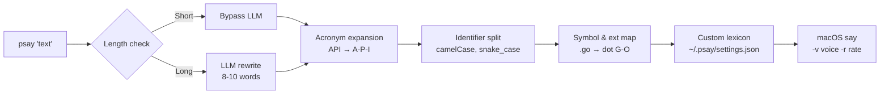

# psay

Phonetic text processing for the macOS `say` command. Makes developer jargon readable by voice.

`psay "Found deadlock in auth_service.go due to A-B-A problem in the mutex pool."`

→ macOS `say` hears: *"Found deadlock in auth service dot G-O due to A-B-A problem in the mutex pool."*

Built by **reusing existing Go libraries** — no reinventing the wheel.

## Problem

macOS `say` is a solid TTS engine, but it reads developer text literally:

- `API` → "ah-pee-ee" (wrong)
- `getUserById` → "get user by id" (misses the acronym)
- `auth_service.go` → mangled
- Long explanations get spoken in full, burning time on noise

## What psay does

psay sits between an AI agent and `say`, running a **phonetic pipeline** that transforms text before it reaches the TTS engine:



## Dependencies

psay reuses these Go libraries instead of writing everything from scratch:

| Pipeline step | Library | Why |
|---|---|---|
| CLI parsing | stdlib `flag` package | Voice override via `-v` flag. Zero dependencies |
| CamelCase split | Inline helper (~20 lines) | Uses `unicode.IsUpper/IsLower` — no dependency needed. The archived library was trivial |
| LLM client | [`sashabaranov/go-openai`](https://github.com/sashabaranov/go-openai) | OpenAI-compatible API (works with OpenAI, Ollama, Groq, Claude proxy) |
| Home dir path | stdlib `os.UserHomeDir()` | No dependency needed. Available since Go 1.12 |
| Audio output | macOS `/usr/bin/say` | Native `os/exec` — no audio library needed |

## Configuration

Settings are stored at `~/.psay/settings.json`:

```json
{
  "voice": "Samantha",
  "rate": 200,
  "llm": {
    "enabled": true,
    "bypass_word_threshold": 12,
    "api_key": "env:LLM_API_KEY",
    "model": "gpt-4o-mini"
  },
  "lexicon": {
    "db": "database",
    "err": "error",
    "nil": "null",
    "repo": "repository",
    "auth": "authentication"
  }
}
```

The config auto-initializes if missing. Lexicon is a simple key-value map — edit directly in a text editor.

## Example: AGENTS.md

Example block to add to an AI agent's `AGENTS.md`:

````markdown
## Audio Announcement Protocol

Use `psay` for key actions, decisions, discoveries, and recommendations.

```bash
psay '[Action/Discovery] on [Target] because [Context]. [My Take / Advice]'
```

### Examples

* `psay 'Found critical deadlock in auth_service.go due to mutex contention. Hold off on manual testing while I refactor it to atomic pointers.'`
* `psay 'Pivoting payment service to mock gateway because Stripe API returned rate limit errors. No action needed on your side, I will handle the retry logic.'`
* `psay 'PostgreSQL cluster migration failed on edge nodes due to memory limits. Approve increasing the node specs before I re-run the job.'`

### Rules

* **Include Context & Take:** Always specify **Action/Discovery**, **Target**, **Reason**, and **Your Take** (what you think or what to do next).
* **Dense & Fact-Rich:** Provide rich technical context. Don't worry about word count — the audio engine will rewrite it for brevity.
* **No Raw Syntax:** Do not pass raw code blocks, stack traces, or massive terminal logs directly.
* **When:** Use when starting tasks, pivoting, discovering issues, or recommending actions. Never announce routine completion.
````

## Backlog

### Phase 1 — Minimal Working Engine (MVP)
> A working `psay` binary that reads config and speaks through macOS `say`.

- [ ] **Setup & dependencies** — `go mod init psay`. Only external dep is `go-openai` (everything else is stdlib or macOS native)
- [ ] **Config loader & auto-init** — read/create `~/.psay/settings.json` on first run
- [ ] **CLI & audio output** — parse args via cobra, run `exec.Command("/usr/bin/say", "-v", voice, "-r", rate, text)`
- [ ] **Custom lexicon replacer** — loop over `lexicon` entries in settings, `strings.ReplaceAll`

### Phase 2 — Phonetic Engine
> Reads acronyms, file names, symbols, and camelCase correctly using existing parsing libs.

- [ ] **Identifier & acronym processor** — inline `splitCamelCase()` using `unicode.IsUpper/IsLower`, regex for uppercase acronyms (`API` → `A-P-I`) and `snake_case`
- [ ] **Symbol & extension mapper** — map table for common symbols and file extensions (`.go` → `dot G-O`, `!=` → `not equal`)

### Phase 3 — Smart Summarization
> Long messages get condensed via LLM using the OpenAI Go SDK.

- [ ] **Bypass threshold check** — skip LLM if word count ≤ `bypass_word_threshold`
- [ ] **LLM client integration** — `sashabaranov/go-openai` to call API, system prompt to condense to 8–10 words: `[Core Problem] + [Action/Advice]`
- [ ] **Fallback** — if API call fails, route to phonetic processor directly
