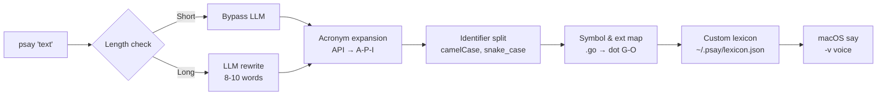

# psay

Phonetic text processing for the macOS `say` command. Makes developer jargon readable by voice.

`psay "Found deadlock in auth_service.go due to A-B-A problem in the mutex pool."`

→ macOS `say` hears: *"Found deadlock in auth service dot G-O due to A-B-A problem in the mutex pool."*

## Problem

macOS `say` is a solid TTS engine, but it reads developer text literally:

- `API` → "ah-pee-ee" (wrong)
- `getUserById` → "get user by id" (misses the acronym)
- `auth_service.go` → mangled
- Long explanations get spoken in full, burning time on noise

## What psay does

psay sits between an AI agent and `say`, running a **phonetic pipeline** that transforms text before it reaches the TTS engine:



## Example: AGENTS.md

Example block to add to an AI agent's `AGENTS.md`:

````markdown
## Audio Announcement Protocol

Use `psay` for key actions, decisions, discoveries, and recommendations.

```bash
psay '[Action/Discovery] on [Target] because [Context]. [My Take / Advice]'
```

### Examples

* `psay 'Found critical deadlock in auth_service.go due to mutex contention. Hold off on manual testing while I refactor it to atomic pointers.'`
* `psay 'Pivoting payment service to mock gateway because Stripe API returned rate limit errors. No action needed on your side, I will handle the retry logic.'`
* `psay 'PostgreSQL cluster migration failed on edge nodes due to memory limits. Approve increasing the node specs before I re-run the job.'`

### Rules

* **Include Context & Take:** Always specify **Action/Discovery**, **Target**, **Reason**, and **Your Take** (what you think or what to do next).
* **Dense & Fact-Rich:** Provide rich technical context. Don't worry about word count — the audio engine will rewrite it for brevity.
* **No Raw Syntax:** Do not pass raw code blocks, stack traces, or massive terminal logs directly.
* **When:** Use when starting tasks, pivoting, discovering issues, or recommending actions. Never announce routine completion.
````

## Backlog

- [ ] CLI receiver — parses `psay "text"` input
- [ ] Regex-based phonetic processor — acronyms (`API` → `A-P-I`), camelCase and snake_case splitting (`getUserById` → `get user by I-D`), symbol and file extension mapping (`.go` → `dot G-O`, `!=` → `not equal`)
- [ ] macOS `say` executor — calls `say` with configurable voice (`-v`)
- [ ] LLM bypass — skip LLM for short, well-structured messages (zero latency)
- [ ] LLM rewrite — condense long messages to 8–10 words: `[Core Problem] + [Action/Advice]`
- [ ] LLM fallback — route to phonetic-only processing if LLM is unavailable
- [ ] Custom lexicon — `~/.psay/lexicon.json` for user-defined pronunciation overrides (e.g., `"kubectl": "kube-control"`), edited manually